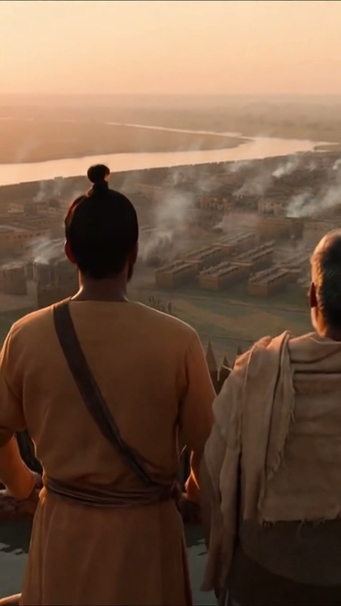

# Chakravarti: Chronicles of Bharat

A mobile-first historical strategy anthology about Indian rulers, defenders,
statecraft, and decisive wars. The flagship campaign is **Mauryan Rise**, a
six-season 3D kingdom-building chapter with Chandragupta Maurya and Kautilya.
The earlier **Cost of Kalinga** tactical chapter remains playable.

**Play:** <https://naveenneog.github.io/Chakravarti/>  
**Android APK:** <https://github.com/naveenneog/Chakravarti/releases/download/v0.3.0/Chakravarti-v0.3.0.apk>



The game never treats tactical invention as established history. Every chapter
separates:

- **Recorded evidence** from inscriptions, archaeology, coins, and contemporary
  or near-contemporary sources.
- **Claims inside a source**, such as the human toll stated in Ashoka's Major
  Rock Edict XIII.
- **Gameplay reconstruction**, including maps, formations, unit rosters, and
  turn objectives that are not preserved in the historical record.

## Play locally

```powershell
npm install
npm run dev
```

## Validate

```powershell
npm test
npm run build
npm run lint
```

## Playable campaigns

### Mauryan Rise

- Lazy-loaded, mobile-optimized React Three Fiber province.
- Pataliputra reconstruction, river, farms, market, barracks, fort, army camp,
  Chandragupta, and Kautilya rendered as a low-poly living world.
- Six deterministic seasons with food, treasury, legitimacy, readiness, threat,
  construction, recruitment, army upkeep, and three possible endings.
- Six evidence-labeled council debates with visible forecasts and source notes.
- Infantry, archers, cavalry, and elephants with distinct support requirements,
  upkeep, formation roles, and counters.
- Pre-resolved 3D border-war vignette with pause and instant resolution.
- Versioned local save, ordered command log, replay-safe outcomes, and a complete
  accessible HTML fallback when WebGL is unavailable.
- Original adaptive Web Audio score plus Azure Speech voices for Chandragupta,
  Kautilya, and the campaign narrator.
- Azure Sora mobile cinematic for the Mauryan world.

### The Cost of Kalinga

- Portrait-first 7x8 tactical battlefield.
- Deterministic terrain, movement, combat, enemy turns, and cost-of-war score.
- Historical evidence cards and a source-backed Kalinga codex.

## Distribution direction

1. **Mobile first:** installable PWA and Capacitor Android APK.
2. **Desktop second:** the same React rules and content packaged with Tauri,
   adding keyboard shortcuts, larger maps, and expanded command panels.

The rules engine and scenario data stay platform-neutral so mobile and desktop
do not fork into different games.

See [project-docs/GAME_DESIGN.md](project-docs/GAME_DESIGN.md),
[project-docs/HISTORICAL_METHOD.md](project-docs/HISTORICAL_METHOD.md), and
[project-docs/AZURE_MEDIA_PIPELINE.md](project-docs/AZURE_MEDIA_PIPELINE.md).
The reviewed expansion plan is in
[project-docs/MAURYAN_RISE_ROADMAP.md](project-docs/MAURYAN_RISE_ROADMAP.md).

## Android package

```powershell
npm run apk
```

This produces `Chakravarti-v<version>.apk`, signed with the Android debug key
for direct installation and GitHub release distribution.

## GitHub Pages package

```powershell
npm run build:pages
```

The generated `docs/` directory is the deployable GitHub Pages site.
