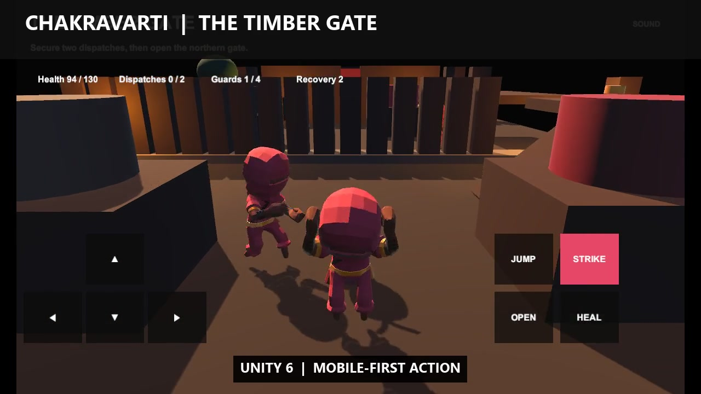

# Chakravarti: Chronicles of Bharat

A mobile-first historical action-strategy anthology about Indian rulers,
defenders, statecraft, and decisive wars. **The Timber Gate** now connects
Kautilya's strategic planning to a playable third-person Chandragupta mission.
The six-season **Mauryan Rise** kingdom campaign and earlier **Cost of Kalinga**
tactical chapter remain playable.

The production action client is now being rebuilt in **Unity 6** under
`unity/ChakravartiAction`. The web build remains available as the strategy and
historical-content prototype.

**Play:** <https://naveenneog.github.io/Chakravarti/>  
**Android APK:** <https://github.com/naveenneog/Chakravarti/releases/download/v0.4.2/Chakravarti-v0.4.2.apk>

**Unity Windows:** <https://github.com/naveenneog/Chakravarti/releases/download/v0.5.0/ChakravartiAction-v0.5.0-Windows.zip>
**Unity Android:** <https://github.com/naveenneog/Chakravarti/releases/download/v0.5.0/ChakravartiAction-v0.5.0.apk>



The GitHub Pages home screen now includes a real Unity gameplay trailer and two
vertical shorts generated from a deterministic native capture sequence.

The game never treats tactical invention as established history. Every chapter
separates:

- **Recorded evidence** from inscriptions, archaeology, coins, and contemporary
  or near-contemporary sources.
- **Claims inside a source**, such as the human toll stated in Ashoka's Major
  Rock Edict XIII.
- **Gameplay reconstruction**, including maps, formations, unit rosters, and
  turn objectives that are not preserved in the historical record.

## Play locally

```powershell
npm install
npm run dev
```

## Validate

```powershell
npm test
npm run build
npm run lint
```

## Playable campaigns

### The Fall of the Nandas: The Timber Gate

- Open on a cinematic story intro (Sora-generated) that sets the chapter, then a
  first-run tutorial teaching move, jump, strike, open, and heal before play.
- Launch directly behind Chandragupta in the full-screen 3D mission; menus and
  strategy never block first play.
- Use an articulated hero with running, jumping, and sword-swing motion from a
  closer third-person camera.
- Hear adaptive music, city and river ambience, footsteps, sword swings,
  impacts, damage, objectives, recovery, and the timber gate.
- Rigged CC0 character bases are restyled with original bone-attached clothing
  and accessories rather than shipped with their source-pack appearance.
- Choose intelligence, alliance, and logistics preparations before entering the
  reconstructed Pataliputra district only when opening the optional War Council.
- Control Chandragupta in a mobile third-person mission with movement, jumping,
  elevated routes, close combat, enemy pursuit, recovery, dispatch objectives,
  and a final gate interaction.
- Every strategic choice changes guards, objective visibility, routes, health,
  mobility, damage, or recovery supplies.
- Complete campaign command mode provides the same strategy-to-outcome loop
  without WebGL, but remains secondary to the graphical mission.
- Strategy state, locked mission modifiers, results, and ordered commands are
  versioned and replay-tested.
- CC0 Kenney vegetation and a project-original storage jar generated with a
  Hugging Face TripoSR ONNX model are tracked in
  [Asset Provenance](project-docs/ASSET_PROVENANCE.md).

### Mauryan Rise

- Lazy-loaded, mobile-optimized React Three Fiber province.
- Pataliputra reconstruction, river, farms, market, barracks, fort, army camp,
  Chandragupta, and Kautilya rendered as a low-poly living world.
- Six deterministic seasons with food, treasury, legitimacy, readiness, threat,
  construction, recruitment, army upkeep, and three possible endings.
- Six evidence-labeled council debates with visible forecasts and source notes.
- Infantry, archers, cavalry, and elephants with distinct support requirements,
  upkeep, formation roles, and counters.
- Pre-resolved 3D border-war vignette with pause and instant resolution.
- Versioned local save, ordered command log, replay-safe outcomes, and a complete
  accessible HTML fallback when WebGL is unavailable.
- Original adaptive Web Audio score plus Azure Speech voices for Chandragupta,
  Kautilya, and the campaign narrator.
- Azure Sora mobile cinematic for the Mauryan world.

### The Cost of Kalinga

- Portrait-first 7x8 tactical battlefield.
- Deterministic terrain, movement, combat, enemy turns, and cost-of-war score.
- Historical evidence cards and a source-backed Kalinga codex.

## Distribution direction

1. **Mobile first:** installable PWA and Capacitor Android APK.
2. **Desktop second:** the same campaign rules and content with keyboard,
   controller, larger maps, and expanded command panels.
3. **Native action production:** the web mission proves the action-strategy
   contract. A longer parkour-and-combat campaign should move the action client
   to Unity while preserving the versioned campaign commands and JSON content.

The rules engine and scenario data stay platform-neutral so mobile and desktop
do not fork into different games.

See [project-docs/GAME_DESIGN.md](project-docs/GAME_DESIGN.md),
[project-docs/HISTORICAL_METHOD.md](project-docs/HISTORICAL_METHOD.md), and
[project-docs/AZURE_MEDIA_PIPELINE.md](project-docs/AZURE_MEDIA_PIPELINE.md).
The native action architecture is documented in
[project-docs/UNITY_ACTION_ARCHITECTURE.md](project-docs/UNITY_ACTION_ARCHITECTURE.md).
The reviewed expansion plan is in
[project-docs/MAURYAN_RISE_ROADMAP.md](project-docs/MAURYAN_RISE_ROADMAP.md).
Open-source and generated art provenance is in
[project-docs/ASSET_PROVENANCE.md](project-docs/ASSET_PROVENANCE.md).

## Android package

```powershell
npm run apk
```

This produces `Chakravarti-v<version>.apk`, signed with the Android debug key
for direct installation and GitHub release distribution.

## GitHub Pages package

```powershell
npm run build:pages
```

The generated `docs/` directory is the deployable GitHub Pages site.
