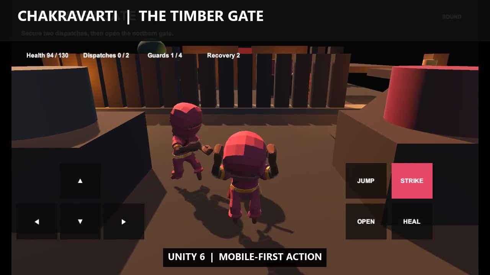

# Chakravarti: Chronicles of Bharat

A mobile-first historical action-strategy anthology about Indian rulers,
defenders, statecraft, and decisive wars. **The Timber Gate** now connects
Kautilya's strategic planning to a playable third-person Chandragupta mission.
The six-season **Mauryan Rise** kingdom campaign and earlier **Cost of Kalinga**
tactical chapter remain playable.

The **web / PWA client** (React 19 + React-Three-Fiber, under `src/`) is the
authoritative, actively developed product, deployed to GitHub Pages and packaged
for Android with Capacitor. A separate **Unity 6** native client under
`unity/ChakravartiAction` is a **frozen v0.5.0 vertical-slice prototype**: it
does not have the guard AI, boss fight, story intro, tutorial, or cutscenes
added to the web client since v0.5.0. See
[`project-docs/UNITY_QA_REPORT.md`](project-docs/UNITY_QA_REPORT.md) for the QA
status and divergence matrix.

**Play:** <https://naveenneog.github.io/Chakravarti/>  
**Android APK (current, Capacitor):** build locally with `npm run apk` (produces `Chakravarti-vX.Y.Z.apk`)

**Unity Windows:** <https://github.com/naveenneog/Chakravarti/releases/download/v0.5.0/ChakravartiAction-v0.5.0-Windows.zip>
**Unity Android:** <https://github.com/naveenneog/Chakravarti/releases/download/v0.5.0/ChakravartiAction-v0.5.0.apk>



The GitHub Pages home screen now includes a real Unity gameplay trailer and two
vertical shorts generated from a deterministic native capture sequence.

The game never treats tactical invention as established history. Every chapter
separates:

- **Recorded evidence** from inscriptions, archaeology, coins, and contemporary
  or near-contemporary sources.
- **Claims inside a source**, such as the human toll stated in Ashoka's Major
  Rock Edict XIII.
- **Gameplay reconstruction**, including maps, formations, unit rosters, and
  turn objectives that are not preserved in the historical record.

## Play locally

```powershell
npm install
npm run dev
```

## Validate

```powershell
npm test
npm run lint
npm run build

# Browser smoke test (build the Pages bundle first)
npm run build:pages
npm run test:smoke
```

## Playable campaigns

### The Fall of the Nandas: The Timber Gate

- Open on a cinematic story intro (Sora-generated) that sets the chapter, then a
  first-run tutorial teaching move, jump, strike, open, and heal before play.
- Launch directly behind Chandragupta in the full-screen 3D mission; menus and
  strategy never block first play.
- Use an articulated hero with running, jumping, and sword-swing motion from a
  closer third-person camera.
- Hear adaptive music, city and river ambience, footsteps, sword swings,
  impacts, damage, objectives, recovery, and the timber gate.
- Rigged CC0 character bases are restyled with original bone-attached clothing
  and accessories rather than shipped with their source-pack appearance.
- Choose intelligence, alliance, and logistics preparations before entering the
  reconstructed Pataliputra district only when opening the optional War Council.
- Control Chandragupta in a mobile third-person mission with movement, jumping,
  elevated routes, close combat, enemy pursuit, recovery, dispatch objectives,
  and a final gate interaction.
- **Answer every telegraph.** Guards and the captain wind up before they swing.
  Raise **Guard** as the blow lands to **parry** it — the attacker staggers and
  your next strike is a riposte; raise it in the first sliver of the window for a
  **perfect parry**. Hold it early and you only **block**, paid for out of
  **Resolve**; empty that and your guard **breaks**. A blow from outside your
  frontal arc lands in full, so being flanked is a real threat.
- Swings are honest: you hit what is in reach *and* in front of you, and you turn
  onto whatever you hit.
- Evade stealth-aware guards: they patrol routes, spot you through a vision cone,
  hear running and fighting, investigate, flank, telegraph strikes, and retreat
  when wounded, so breaking line of sight and staying quiet matter.
- Face a **roster**, not one repeated guard. Sentries swing a broad two-handed
  sword; **javelineers** step into a longer thrust so retreating no longer saves
  you; **shieldbearers** carry a tall, narrow ox-hide buckler that deflects
  anything from the front, so you flank them or punish the beat after their own
  blow; **archers** need a long draw to bend a bow their own height, so you close
  the gap, break line of sight, or time your Guard to knock the arrow down. The
  equipment is drawn from Arrian's summary of Megasthenes on Indian infantry; the
  behaviour is labelled gameplay reconstruction.
- Face the **Nanda Captain** boss at the gate: a three-phase fight with
  telegraphed heavy strikes and lunges that escalate as it loses health, with
  vulnerable recovery windows to punish. A perfect parry forces that window open
  on demand instead of waiting for a lunge to end. The gate opens only once it
  falls.
- Every strategic choice changes guards, objective visibility, routes, health,
  mobility, damage, or recovery supplies.
- Complete campaign command mode provides the same strategy-to-outcome loop
  without WebGL, but remains secondary to the graphical mission.
- Strategy state, locked mission modifiers, results, and ordered commands are
  versioned and replay-tested.
- CC0 Kenney vegetation and a project-original storage jar generated with a
  Hugging Face TripoSR ONNX model are tracked in
  [Asset Provenance](project-docs/ASSET_PROVENANCE.md).

### Mauryan Rise

- Lazy-loaded, mobile-optimized React Three Fiber province.
- Pataliputra reconstruction, river, farms, market, barracks, fort, army camp,
  Chandragupta, and Kautilya rendered as a low-poly living world.
- Six deterministic seasons with food, treasury, legitimacy, readiness, threat,
  construction, recruitment, army upkeep, and three possible endings.
- Six evidence-labeled council debates with visible forecasts and source notes.
- Infantry, archers, cavalry, and elephants with distinct support requirements,
  upkeep, formation roles, and counters.
- Pre-resolved 3D border-war vignette with pause and instant resolution.
- Versioned local save, ordered command log, replay-safe outcomes, and a complete
  accessible HTML fallback when WebGL is unavailable.
- Original adaptive Web Audio score plus Azure Speech voices for Chandragupta,
  Kautilya, and the campaign narrator.
- Azure Sora mobile cinematic for the Mauryan world.

### The Western Horizon

- Conduct Chandragupta II's western campaign against the Kshatrapas across eight
  seasons — routes, the Vakataka marriage, mint policy, endowments, and local
  officers.
- **There is no battle to win**, because no securely preserved account of one
  exists. The chapter refuses to invent it and makes that the mechanic instead.
- Coinage is the scoreboard: Kshatrapa silver must actually stop circulating and
  your silver, cut to their weight standard so their markets accept it, must take
  its place. That needs acceptance, not only reach.
- Every season either leaves a durable artifact — a coin type, an inscription, a
  dynastic charter — or leaves nothing at all. Marches and garrisons leave
  nothing.
- The ending is a historian's dossier reconstructing your reign sixteen centuries
  later, with a coinage chart drawn from your own campaign, split into what
  survives and what did not. Win by force alone and the record cannot say what
  you did.
- Every claim is labelled and cited: cessation of Kshatrapa silver, Gupta silver
  in their standard, the Udayagiri and Sanchi inscriptions, the Vakataka
  charters, and the disputed Mehrauli pillar.

### The Brahmaputra Holds

- Lachit Borphukan's defence of Guwahati, 1667–1671, ending at Saraighat.
- **Choose the ground.** Raise earthworks until the land approach is shut, and
  the imperial fleet has to come up the narrows, where a heavy fleet cannot
  deploy and a light one can. You never pick the narrows from a menu — you earn
  them by making every other approach impossible.
- Accept battle in the open field and none of it counts. That is what happened at
  Alaboi.
- The one chapter in the anthology where **two independent traditions
  corroborate each other**: every season shows the Assamese buranji account and
  the Mughal-side account side by side, with agreement marked.

### The Defiance at Narrai

- Rani Durgavati's defence of Gondwana, 1564.
- **You cannot win, and the chapter does not pretend otherwise.** What you
  control is what you spend and for what: the price the invasion pays, or the
  people who get out ahead of it.
- Afterwards you read the only account of this campaign that survives. It is four
  sentences long and it was written by the people you fought — beside a list of
  everything you did that it does not preserve.
- No Gond account exists. The chapter says so, and is built around the absence.

### The Hills of Pratapgad

- The meeting beneath the fort, 10 November 1659.
- **You never fight.** There is no strike, no target and no combat in this
  chapter. You arrange the hills — scouting, lookouts, a concealed reserve, a
  signal chain, a withdrawal route — and the arrangement is judged on its weakest
  part, not its average.
- The encounter itself is shown but not depicted and not adjudicated. The
  aftermath lays the contradictory accounts side by side and marks each disputed
  question **unresolved**, with the reason it cannot presently be settled.

### The Cost of Kalinga

- Portrait-first 7x8 tactical battlefield.
- Deterministic terrain, movement, combat, enemy turns, and cost-of-war score.
- Historical evidence cards and a source-backed Kalinga codex.

## Distribution direction

1. **Mobile first:** installable PWA and Capacitor Android APK.
2. **Desktop second:** the same campaign rules and content with keyboard,
   controller, larger maps, and expanded command panels.
3. **Native action production:** the web mission proves the action-strategy
   contract. A longer parkour-and-combat campaign should move the action client
   to Unity while preserving the versioned campaign commands and JSON content.

The rules engine and scenario data stay platform-neutral so mobile and desktop
do not fork into different games.

See [project-docs/GAME_DESIGN.md](project-docs/GAME_DESIGN.md),
[project-docs/HISTORICAL_METHOD.md](project-docs/HISTORICAL_METHOD.md), and
[project-docs/AZURE_MEDIA_PIPELINE.md](project-docs/AZURE_MEDIA_PIPELINE.md).
The native action architecture is documented in
[project-docs/UNITY_ACTION_ARCHITECTURE.md](project-docs/UNITY_ACTION_ARCHITECTURE.md).
The reviewed expansion plan is in
[project-docs/MAURYAN_RISE_ROADMAP.md](project-docs/MAURYAN_RISE_ROADMAP.md).
Open-source and generated art provenance is in
[project-docs/ASSET_PROVENANCE.md](project-docs/ASSET_PROVENANCE.md).

## Android package

```powershell
npm run apk
```

This produces `Chakravarti-v<version>.apk`, signed with the Android debug key
for direct installation and GitHub release distribution.

## GitHub Pages package

```powershell
npm run build:pages
```

The generated `docs/` directory is the deployable GitHub Pages site.
